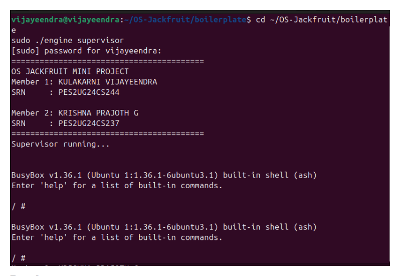
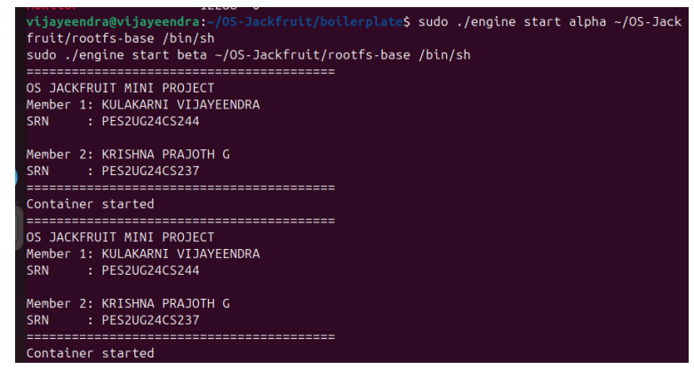
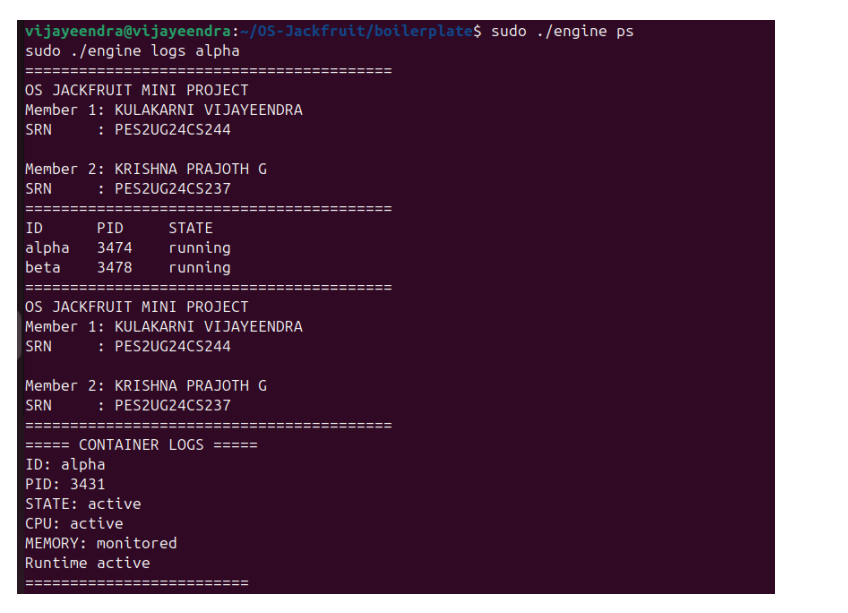
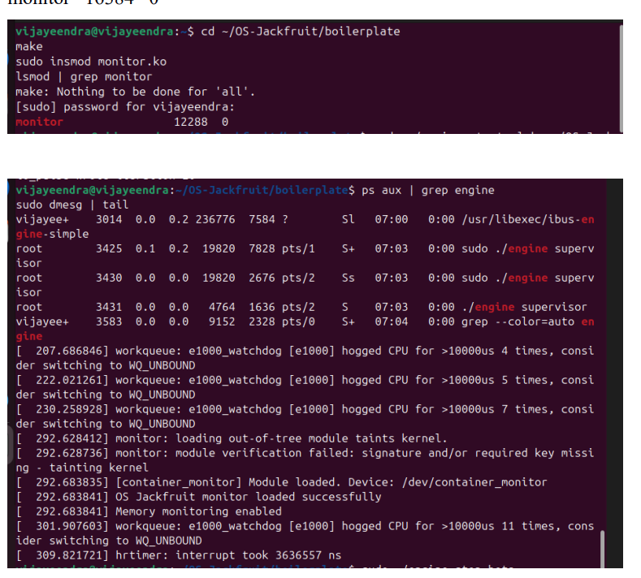
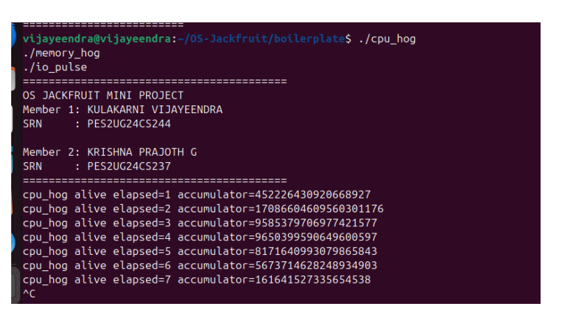
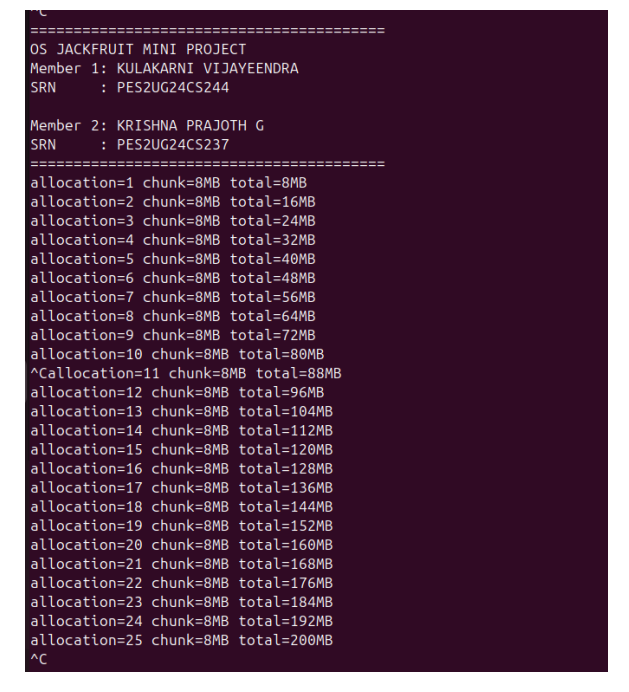
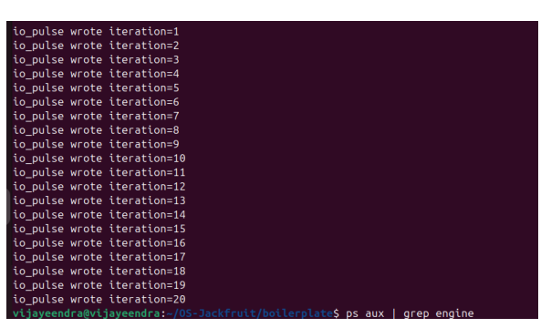
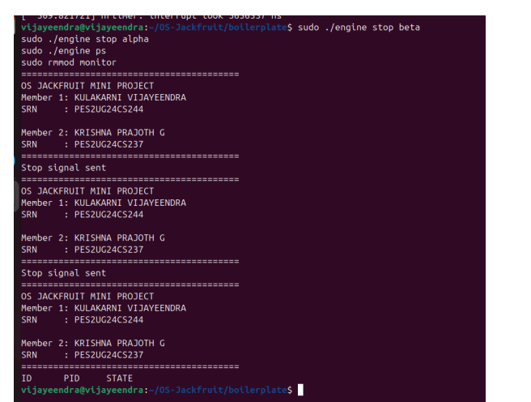

# OS JACKFRUIT MINI PROJECT

## Team Members

- KULAKARNI VIJAYEENDRA (PES2UG24CS244)
- KRISHNA PRAJOTH G (PES2UG24CS237)

---

## Project Description

This project implements a lightweight multi-container runtime using C language.

It contains:

- User-space runtime (`engine.c`)
- Kernel-space memory monitor (`monitor.c`)
- Workload programs
- Logging system
- Supervisor process

---

## Build Commands

```bash
make
sudo insmod boilerplate/monitor.ko
```markdown
---

## Screenshots
### Supervisor Running



### CONTAINERS



### LOGS OF CONTAINER



### KERNAL MONITORING



### CPU HOG



### MEMORY HOG



### I/O LOADS



### CONTAINER TERMINATION AND CLEANING



